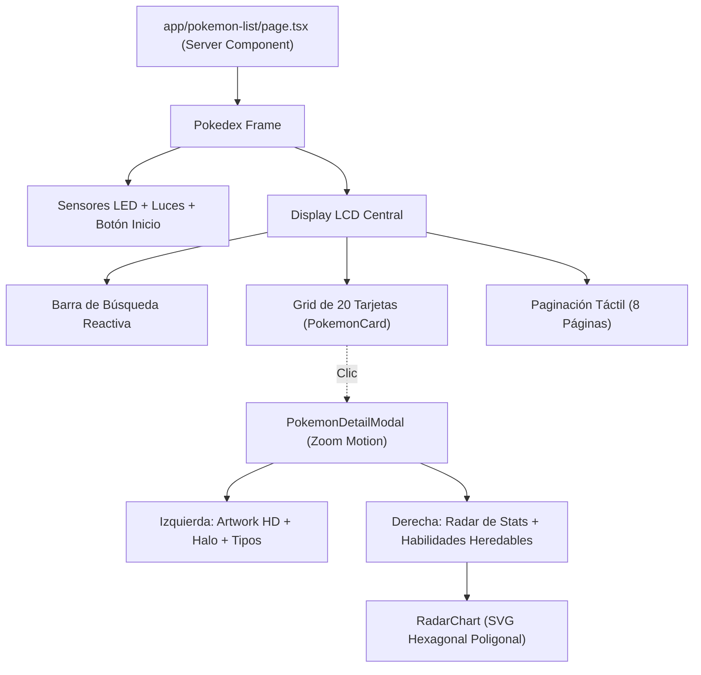

# Sistema de Diseño Gráfico — Poké Connection ⚡

Documentación técnica y artística de los recursos visuales, paletas de color, física de movimiento y modelos geométricos implementados en el proyecto **Poké Connection**.

---

## 1. Dirección de Arte & Concepto Visual

El proyecto fusiona la nostalgia del **hardware retro de Nintendo (Pokédex Clásica Kanto)** con la viveza del **anime contemporáneo** y micro-interacciones de alta fidelidad:

- **Efecto Hardware Táctil:** El chasis exterior simula el plástico rojo y aluminio de una Pokédex física con biselados, sombras volumétricas y una pantalla interna en cristal oscuro ahumado (`slate-900`).
- **Acento Luminoso Anime:** Lente sensor esférico en azul zafiro con destellos de luz especular y LEDs tricolor (rojo, ámbar y esmeralda) con resplandor pulsante (*glow*).
- **Inmersión Elemental:** La interfaz responde y se adapta cromáticamente al tipo elemental dominante del Pokémon seleccionado.

---

## 2. Paleta Cromática

### 2.1 Colores de Chasis y Hardware (Pokédex)
| Componente | Token / Tailwind | Hex | Uso |
| :--- | :--- | :--- | :--- |
| **Cuerpo Principal** | `from-red-600 via-red-500 to-red-700` | `#DC2626` / `#EF4444` / `#B91C1C` | Carcasa plástica exterior |
| **Borde Biselado** | `border-red-800` | `#991B1B` | Contorno y hendiduras mecánicas |
| **Lente Sensor** | `bg-sky-400` + `shadow-[0_0_20px_#38BDF8]` | `#38BDF8` | Ojo óptico del escáner Pokédex |
| **Pantalla Central** | `bg-slate-900` / `border-slate-700` | `#0F172A` / `#334155` | Display LCD interior con bordes metálicos |
| **D-Pad & Botones** | `bg-slate-900` / `bg-slate-800` | `#0F172A` / `#1E293B` | Controles de navegación hardware |
| **Acentos Neón** | `yellow-400` / `amber-500` | `#FACC15` / `#F59E0B` | Botones activos de paginación y selección |

---

### 2.2 Diccionario Cromático por Tipo Elemental
Cada tipo elemental cuenta con su propia tríada de gradiente, color de acento para el radar SVG y estilo de insignia (*badge*):

| Tipo | Etiqueta | Código Hex (Radar SVG) | Gradiente de Fondo | Insignia (*Badge*) |
| :--- | :--- | :--- | :--- | :--- |
| **Fuego** | Fuego | `#F08030` | `from-orange-500 via-amber-500 to-red-600` | Naranja a Rojo Fuego |
| **Agua** | Agua | `#6890F0` | `from-sky-400 via-blue-500 to-indigo-600` | Azul Marino a Cian |
| **Planta** | Planta | `#78C850` | `from-emerald-400 via-green-500 to-teal-700` | Esmeralda a Verde Bosque |
| **Eléctrico** | Eléctrico | `#F8D030` | `from-amber-300 via-yellow-400 to-amber-500` | Amarillo Neón a Ámbar |
| **Psíquico** | Psíquico | `#F85888` | `from-pink-500 via-rose-500 to-fuchsia-600` | Magenta a Rosa Eléctrico |
| **Hielo** | Hielo | `#98D8D8` | `from-cyan-300 via-sky-400 to-blue-400` | Cian Escarcha a Celeste |
| **Dragón** | Dragón | `#7038F8` | `from-violet-600 via-indigo-700 to-blue-800` | Violeta Real a Índigo |
| **Fantasma** | Fantasma | `#705898` | `from-indigo-700 via-purple-800 to-slate-900` | Púrpura Sombrío |
| **Veneno** | Veneno | `#A040A0` | `from-purple-500 via-fuchsia-600 to-purple-800` | Púrpura Tóxico |
| **Tierra** | Tierra | `#E0C068` | `from-amber-600 via-yellow-700 to-amber-800` | Ocre Desierto |
| **Roca** | Roca | `#B8A038` | `from-yellow-700 via-amber-800 to-stone-800` | Ámbar Granito |
| **Bicho** | Bicho | `#A8B820` | `from-lime-500 via-emerald-600 to-green-700` | Lima Vivo a Verde Musgo |
| **Lucha** | Lucha | `#C03028` | `from-red-600 via-rose-700 to-red-900` | Rojo Carmesí Combate |
| **Volador** | Volador | `#A890F0` | `from-indigo-300 via-sky-400 to-blue-500` | Azul Cielo Eólico |
| **Acero** | Acero | `#B8B8D0` | `from-slate-400 via-zinc-500 to-slate-600` | Titanio Metálico |
| **Hada** | Hada | `#EE99AC` | `from-pink-300 via-rose-400 to-fuchsia-400` | Rosa Pastel Mágico |
| **Normal** | Normal | `#A8A878` | `from-stone-400 to-stone-600` | Pizarra Neutra |

---

## 3. Geometría y Matemáticas del Gráfico de Radar (Telaraña Poligonal)

El componente `RadarChart.tsx` proyecta las 6 estadísticas base del Pokémon en un hexágono radial de coordenadas cartesianas:

```text
                  [1] Salud (PS)
                        ▲ -90°
                        │
   [6] Atq. Esp. ◄──────┼──────► [2] Ataque
         -150°          │          -30°
                        │
   [5] Def. Esp. ◄──────┼──────► [3] Defensa
         +150°          │          +30°
                        ▼ +90°
                  [4] Velocidad
```

### 3.1 Ecuaciones Trigonométricas

Para un centro $(C_x, C_y) = (140, 140)$, un radio exterior $R = 80\text{px}$ y un valor máximo de referencia de $160$ puntos base:

$$\theta_i = -\frac{\pi}{2} + i \cdot \left(\frac{2\pi}{6}\right), \quad i \in \{0, 1, 2, 3, 4, 5\}$$

$$r_i = \text{clamp}\left(\frac{\text{stat}_i}{160}, 0.12, 1.0\right) \times R$$

$$x_i = C_x + r_i \cdot \cos(\theta_i)$$
$$y_i = C_y + r_i \cdot \sin(\theta_i)$$

### 3.2 Capas Gráficas del SVG
1. **Resplandor Central:** Gradiente radial difuminado con el color elemental del Pokémon (`fill="url(#centerGlow)"`).
2. **Cuadrícula de Referencia:** Cuatro anillos concéntricos hexagonales en el $25\%$, $50\%$, $75\%$ y $100\%$ del radio total.
3. **Ejes Cardinales:** Líneas segmentadas conectando el origen con los 6 vértices límite.
4. **Polígono de Estadísticas (`motion.polygon`):** Gradiente semitransparente con opacidad superior al $55\%$ y borde grueso iluminado de $2.5\text{px}$.
5. **Nodos Vértice (`motion.circle`):** Puntos blancos reflectantes con borde del color temático que aparecen secuencialmente.
6. **Etiquetas Numéricas:** Posicionadas a $R + 28\text{px}$ con anclaje de texto adaptable (`start`, `middle`, `end`) según el cuadrante.

---

## 4. Sistema de Movimiento & Animaciones (Motion)

Se implementaron curvas de animación de física natural (*spring physics*) para evitar sensaciones robóticas:

### 4.1 Entrada del Modal de Detalle (Zoom Efectivo)
```typescript
initial: { scale: 0.75, opacity: 0, y: 30 }
animate: { scale: 1, opacity: 1, y: 0 }
exit:    { scale: 0.8, opacity: 0, y: 20 }
transition: {
  type: "spring",
  damping: 24,
  stiffness: 280
}
```
* **Fondo Difuminado:** Desenfoque progresivo en tiempo real con `backdrop-blur-md` y atenuación a `bg-slate-950/80`.
* **Halo de Luz:** Círculo desenfocado (`blur-3xl`) que pulsa suavemente detrás del Pokémon (`animate-pulse`).

### 4.2 Micro-Interacciones en Tarjetas (`PokemonCard`)
* **Hover:** Escala sutil `scale: 1.05`, elevación en el eje Y `y: -4` y sombra de resplandor amarilla `shadow-yellow-400/20`.
* **Tap / Clic:** Compresión táctil `scale: 0.96`.
* **Prefetch:** Al hacer hover (`onMouseEnter`), se precarga el detalle del Pokémon en la caché de cliente para que la apertura sea instantánea.

### 4.3 Paginación Dinámica
* Transición de página fluida con `AnimatePresence mode="wait"`. Cada cambio de página desliza y desvanece los 20 elementos suavemente (`opacity: 0, y: 10` a `y: 0` en 250ms).

---

## 5. Arquitectura de Componentes de UI



---

## 6. Rendimiento y Accesibilidad (A11y)
- **Zero Layout Shifts:** Dimensiones fijas en imágenes con `next/image` (`width` y `height` declarados).
- **Control por Teclado:** El modal se cierra automáticamente al presionar la tecla `Escape`.
- **Contrastes WCAG 2.2:** Textos con alto contraste sobre fondos oscuros (`slate-900`) e insignias con texto blanco legible.
- **Micro-Cache Client-Side:** `clientDetailCache` en memoria evita consultas duplicadas al navegar entre páginas o reabrir fichas de Pokémon.
